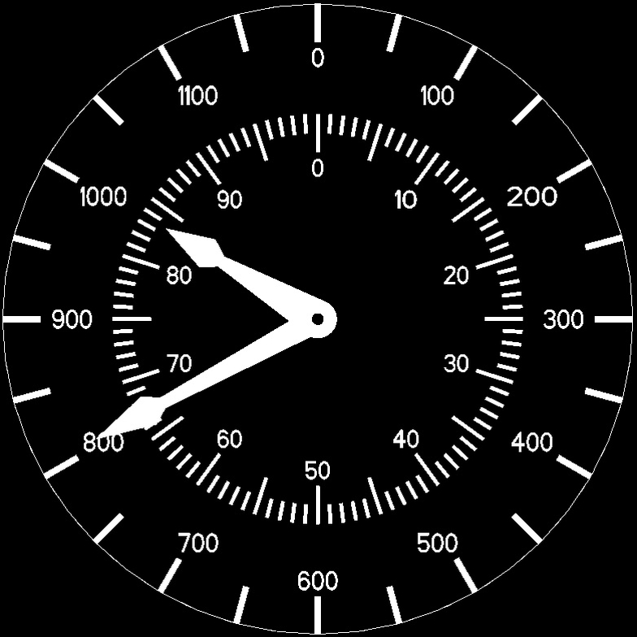
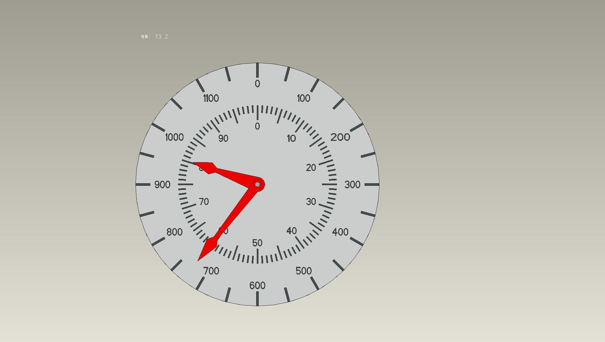
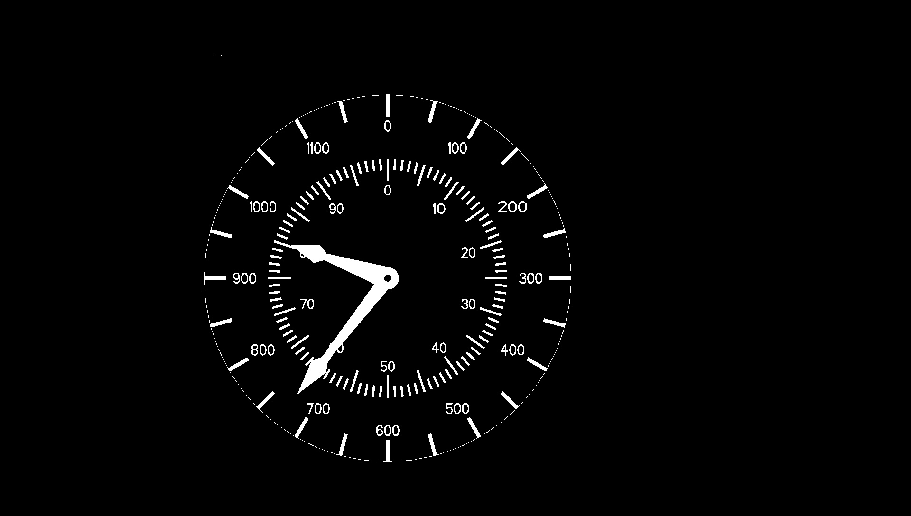

<br><br><br><br>

# pix2pixHD
### [Project](https://tcwang0509.github.io/pix2pixHD/) 
Pytorch implementation of our method for high-resolution (e.g. 2048x1024) photorealistic image-to-image translation. It can be used for turning semantic label maps into photo-realistic images or synthesizing portraits from face label maps. 

## Image-to-image translation at 2k/1k resolution
- Our src images and preprocess image
<p align='left'>  
  
  
  
</p>
- Image-to-image translation results
<p align='center'>  
  
  
</p>


## Prerequisites
- Linux or macOS
- Python 2 or 3
- NVIDIA GPU (11G memory or larger) + CUDA cuDNN

## Getting Started
### Installation
- Install PyTorch and dependencies from http://pytorch.org
- Install python libraries [dominate](https://github.com/Knio/dominate).
```bash
pip install dominate

## pip install ...
pip install dominate -i http://pypi.douban.com/simple --trusted-host pypi.douban.com --user

```
- Clone this repo:
```bash
git clone https://github.com/NVIDIA/pix2pixHD
cd pix2pixHD
```


### Dataset
- We use the BONC dataset. 


### Training
- Train a model 
- `python train.py --label_nc 0 --no_instance --resize_or_crop 1088 --gpu_ids 0,1 --no_flip --tf_log `
- `python test.py --label_nc 0 --no_instance --resize_or_crop none --name bp_ab --resize_or_crop none --gpu_ids 0,1 --no_flip `

